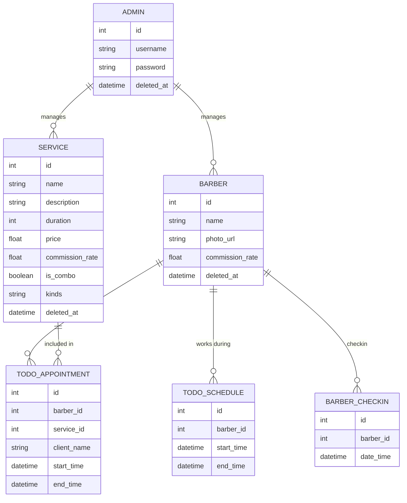

  
### Requisitos do Sistema para a Barbearia (my-barbershop)

#### Funcionalidades Principais:

1. **Área de Administração (ADM):**
    - **Login e gerenciamento de administradores:**
        - Criar, listar, atualizar e remover administradores.
        - Autenticação e autorização de administradores.

    - **Gerenciamento de barbeiros:**
        - Criar, listar, atualizar e remover barbeiros.
        - Fazer check-in de barbeiros e listar check-ins.
        - Adicionar serviços que o barbeiro realiza.

    - **Gerenciamento de serviços:**
        - Criar, listar, atualizar e remover serviços.

    - **TODO: Cadastro de atendimentos:**
        - Criar, listar, iniciar, concluir e remover atendimentos.

    - **TODO: Gerenciamento de agendas:**
        - Cadastro de horários de trabalho pré-definidos para barbeiros.

2. **TODO: Área para Clientes:**
    - Visualização da agenda dos barbeiros.
    - Visualização da fila de atendimentos para cada barbeiro.
    - Estimativa do tempo de espera.
    - Visualização dos serviços oferecidos.
    - Visualização se barbeiro fez check-in.

### Diagrama do Banco de Dados

### Rotas da API

#### Rotas de Autenticação

- `POST /api/admin`
    - Descrição: Criar um administrador.
    - Resposta: Detalhes do barbeiro criado.

- `GET /api/admin`
    - Descrição: Listar administradores.
    - Resposta: Lista de administradores.

- `GET /api/admin/:id`
    - Descrição: Ver detalhes de um administrador.
    - Resposta: Detalhes do administrador.

- `PUT /api/admin/:id`
    - Descrição: Atualizar os dados de um administrador.
    - Resposta: Detalhes do administrador atualizado.

- `DELETE /api/admin/:id`
    - Descrição: Deletar um administrador.
    - Resposta: Status de sucesso.

- `POST /api/auth/login`
    - Descrição: Autenticar o administrador.
    - Resposta: Token de autenticação.

#### Rotas para Barbeiros

- `GET /api/barber`
    - Descrição: Listar todos os barbeiros.
    - Resposta: Lista de barbeiros.

- `GET /api/barber/:id`
    - Descrição: Ver detalhes de um barbeiro.
    - Resposta: Detalhes do barbeiro.

- `POST /api/barber`
    - Descrição: Criar um novo barbeiro.
    - Resposta: Detalhes do barbeiro criado.

- `PUT /api/barber/:id`
    - Descrição: Atualizar os dados de um barbeiro.
    - Resposta: Detalhes do barbeiro atualizado.

- `DELETE /api/barber/:id`
    - Descrição: Deletar um barbeiro.
    - Resposta: Status de sucesso.

- `POST /api/barber/:id/checkin`
    - Descrição: Registrar check-in de um barbeiro.
    - Resposta: Detalhes do check-in.

- `GET /api/barber/:id/checkin`
    - Descrição: Listar check-ins de um barbeiro.
    - Resposta: Lista de check-ins.

#### Rotas para Serviços

- `GET /api/service`
    - Descrição: Listar todos os serviços.
    - Resposta: Lista de serviços.

- `GET /api/service/:id`
    - Descrição: Ver detalhes de um serviço.
    - Resposta: Detalhes do serviço.

- `POST /api/service`
    - Descrição: Criar um novo serviço.
    - Resposta: Detalhes do serviço criado.

- `PUT /api/service/:id`
    - Descrição: Atualizar os dados de um serviço.
    - Resposta: Detalhes do serviço atualizado.

- `DELETE /api/service/:id`
    - Descrição: Deletar um serviço.
    - Resposta: Status de sucesso.

#### TODO: Rotas para Atendimentos

- `GET /api/appointment`
    - Descrição: Listar todos os atendimentos.
    - Resposta: Lista de atendimentos.

- `POST /api/appointment`
    - Descrição: Criar um novo atendimento.
    - Resposta: Detalhes do atendimento criado.

- `PUT /api/appointment/:id/start`
    - Descrição: Iniciar um atendimento.
    - Resposta: Detalhes do atendimento atualizado.

- `PUT /api/appointment/:id/complete`
    - Descrição: Concluir um atendimento.
    - Resposta: Detalhes do atendimento atualizado.

- `DELETE /api/appointment/:id`
    - Descrição: Deletar um atendimento.
    - Resposta: Status de sucesso.

#### TODO: Rotas para Agendas

- `GET /api/schedule`
    - Descrição: Listar todas as agendas.
    - Resposta: Lista de agendas.

- `POST /api/schedule`
    - Descrição: Criar uma nova agenda.
    - Resposta: Detalhes da agenda criada.

- `PUT /api/schedule/:id`
    - Descrição: Atualizar os dados de uma agenda.
    - Resposta: Detalhes da agenda atualizada.

- `DELETE /api/schedule/:id`
    - Descrição: Deletar uma agenda.
    - Resposta: Status de sucesso.

#### TODO: Rotas para Clientes

- `GET /api/public/barber`
    - Descrição: Listar todos os barbeiros com suas agendas.
    - Resposta: Lista de barbeiros e suas agendas.

- `GET /api/public/appointments/barber/:id`
    - Descrição: Verificar a fila de atendimentos de um barbeiro.
    - Resposta: Lista de atendimentos para o barbeiro específico.

- `GET /api/public/waittime/barber/:id`
    - Descrição: Estimar o tempo de espera para um barbeiro específico.
    - Resposta: Tempo estimado de espera.
