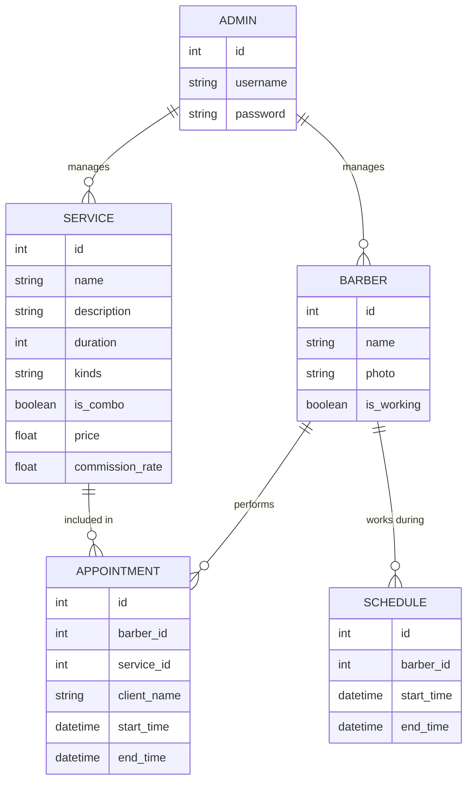

[//]: # (rascunho do projeto)

[//]: # (O sistema terá uma área de adm &#40;com login&#41;, onde o adm pode cadastrar barbeiros e serviços, os barbeiros tem nome e)

[//]: # (foto, e os serviços tem nome, duração media e tipo fixo &#40;barba, cabelo, sobrancelha&#41;, o adm tem uma tela onde pode ver)

[//]: # (os barbeiros colocar se o barbeiro tá ou não trabalhando no momento e cadastrar um atendimento, onde ele seleciona os)

[//]: # (serviços e o barbeiro que vai fazer o nome do cliente, ou alocar pra o que está a mais tempo sem um atendimento, o)

[//]: # (atendimento também deve ter um botao pra iniciar e concluir o atendimento.)

[//]: # (O adm também tem uma parte de agendas, onde pode cadastrar agendas dos barbeiros de forma pré-definida &#40;pra não ter que)

[//]: # (ficar colocando se o barbeiro está ou não trabalhando&#41;)

[//]: # ()

[//]: # (O sistema também terá uma tela para clientes &#40;sem login&#41; onde o cliente pode verificar a agenda dos barbeiros e)

[//]: # (visualizar se tem alguma fila de atendimentos pra aquele barbeiro no momento e quanto tempo demora pra ficar livre.)

[//]: # ()

### Requisitos do Sistema para a Barbearia (my-barbershop)

#### Funcionalidades Principais:

1. **Área de Administração (ADM):**
    - **Login de administrador:**
        - Criação e lisagem, atualização e remoção de administradores.
        - Autenticação e autorização de administradores.
    - **Cadastro de barbeiros:**
        - Nome
        - Foto
    - **Gerenciamento de serviços:**
        - Nome
        - Duração média
        - Tipo (barba, cabelo, sobrancelha)
    - **Gerenciamento de disponibilidade de barbeiros:**
        - Indicar se o barbeiro está trabalhando no momento ou não.
    - **Cadastro de atendimentos:**
        - Nome do cliente
        - Seleção de serviços
        - Seleção de barbeiros ou alocação automática para o barbeiro que está há mais tempo sem atendimento.
        - Botão para iniciar e concluir o atendimento.
    - **Gerenciamento de agendas:**
        - Cadastro de horários de trabalho pré-definidos para barbeiros.

2. **Área para Clientes:**
    - Visualização da agenda dos barbeiros.
    - Visualização da fila de atendimentos para cada barbeiro.
    - Estimativa do tempo de espera.

### Diagrama do Banco de Dados

### Rotas da API

#### Rotas de Autenticação

- `POST /api/admin`
    - Descrição: Criar um administrador.
    - Parâmetros: `username`, `password`
    - Resposta: Detalhes do barbeiro criado.
    - Observação: Rota protegida por autenticação com chave.

- `GET /api/admin`
    - Descrição: Listar administradores.
    - Resposta: Lista administradores.

- `GET /api/admin/:id`
    - Descrição: Ver detalhes de um administrador.
    - Resposta: Detalhes do administrador.

- `PUT /api/admin/:id`
    - Descrição: Atualizar os dados de um administrador.
    - Parâmetros: `password`
    - Resposta: Detalhes do administrador atualizado.

- `DELETE /api/admin/:id`
    - Descrição: Deletar um administrador.
    - Resposta: Status de sucesso.

- `POST /api/auth/login`
    - Descrição: Autenticar o administrador.
    - Parâmetros: `username`, `password`
    - Resposta: Token de autenticação.

#### Rotas para Barbeiros

- `GET /api/barbers`
    - Descrição: Listar todos os barbeiros.
    - Resposta: Lista de barbeiros.

- `GET /api/barbers/:id`
    - Descrição: Ver detalhes de um barbeiro.
    - Resposta: Detalhes do barbeiro.

- `POST /api/barbers`
    - Descrição: Criar um novo barbeiro.
    - Parâmetros: `name`, `photo`, `commission_rate`
    - Resposta: Detalhes do barbeiro criado.

- `PUT /api/barbers/:id`
    - Descrição: Atualizar os dados de um barbeiro.
    - Parâmetros: `name`, `photo`, `is_working`, `commission_rate`
    - Resposta: Detalhes do barbeiro atualizado.

- `DELETE /api/barbers/:id`
    - Descrição: Deletar um barbeiro.
    - Resposta: Status de sucesso.
''
#### Rotas para Serviços

- `GET /api/services`
    - Descrição: Listar todos os serviços.
    - Resposta: Lista de serviços.

- `GET /api/services/:id`
    - Descrição: Ver detalhes de um serviço.
    - Resposta: Detalhes do serviço.

- `POST /api/services`
    - Descrição: Criar um novo serviço.
    - Parâmetros: `name`, `description`, `duration`, `kinds`, `is_combo`, `price`, `commission_rate`
    - Resposta: Detalhes do serviço criado.

- `PUT /api/services/:id`
    - Descrição: Atualizar os dados de um serviço.
    - Parâmetros: `name`, `description`, `duration`, `kinds`, `is_combo`, `price`, `commission_rate`
    - Resposta: Detalhes do serviço atualizado.

- `DELETE /api/services/:id`
    - Descrição: Deletar um serviço.
    - Resposta: Status de sucesso.

#### Rotas para Atendimentos

- `GET /api/appointments`
    - Descrição: Listar todos os atendimentos.
    - Resposta: Lista de atendimentos.

- `POST /api/appointments`
    - Descrição: Criar um novo atendimento.
    - Parâmetros: `barber_id`, `service_id`, `client_name`
    - Resposta: Detalhes do atendimento criado.

- `PUT /api/appointments/:id/start`
    - Descrição: Iniciar um atendimento.
    - Resposta: Detalhes do atendimento atualizado.

- `PUT /api/appointments/:id/complete`
    - Descrição: Concluir um atendimento.
    - Resposta: Detalhes do atendimento atualizado.

- `DELETE /api/appointments/:id`
    - Descrição: Deletar um atendimento.
    - Resposta: Status de sucesso.

#### Rotas para Agendas

- `GET /api/schedules`
    - Descrição: Listar todas as agendas.
    - Resposta: Lista de agendas.

- `POST /api/schedules`
    - Descrição: Criar uma nova agenda.
    - Parâmetros: `barber_id`, `start_time`, `end_time`
    - Resposta: Detalhes da agenda criada.

- `PUT /api/schedules/:id`
    - Descrição: Atualizar os dados de uma agenda.
    - Parâmetros: `barber_id`, `start_time`, `end_time`
    - Resposta: Detalhes da agenda atualizada.

- `DELETE /api/schedules/:id`
    - Descrição: Deletar uma agenda.
    - Resposta: Status de sucesso.

#### Rotas para Clientes

- `GET /api/public/barbers`
    - Descrição: Listar todos os barbeiros com suas agendas.
    - Resposta: Lista de barbeiros e suas agendas.

- `GET /api/public/appointments/barber/:id`
    - Descrição: Verificar a fila de atendimentos de um barbeiro.
    - Resposta: Lista de atendimentos para o barbeiro específico.

- `GET /api/public/waittime/barber/:id`
    - Descrição: Estimar o tempo de espera para um barbeiro específico.
    - Resposta: Tempo estimado de espera.
